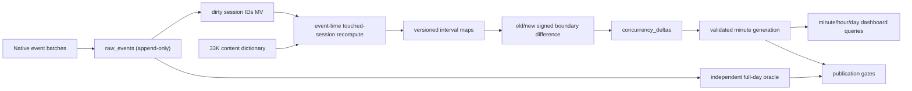

# SonyLIV foreground-only concurrency solution

## Outcome

The coherent design is a hybrid ClickHouse pipeline:

1. keep raw events append-only;
2. recompute only touched sessions in event-time order;
3. normalize truly active ranges as half-open intervals;
4. publish the **difference** between old and new interval boundaries into a
   `SummingMergeTree` point table;
5. derive immutable exact minute snapshots for dashboard peak/average queries;
6. run an independent full-day interval oracle before publishing a generation.

This makes late events and open-session heartbeats small signed corrections. It
does not rely on background `ReplacingMergeTree` merges or ask an incremental
materialized view to infer state across insert blocks.

Provenance labels used below:

- **[official]** directly follows ClickHouse documentation or a supplied contract.
- **[derived]** follows from official behavior plus measured SonyLIV data.
- **[field]** is an operational heuristic that must be measured or confirmed.

The complete measurements are in `evidence/MEASURED.md`; the machine-readable
semantic switches are in `policy.yaml`.

## Workload summary

This is an append-heavy telemetry workload with millisecond event time,
cross-block session state, late/corrected events, mutable open sessions, repeated
date-and-dimension filters, and low-latency peak/average queries. The extract has
905,558 events, 10,866 sessions, 93.16% heartbeat rows, 29.26% physical-order
regressions, 4,209 excess exact duplicates, and a 43.64-hour maximum session.
Those facts rule out arrival-order processing, a start/end overlap shortcut, and
per-query raw-history reconstruction.



## Correctness contract

**[official + derived]** Every interval is UTC `[start,end)`. State is:

```text
active = started
         AND NOT first_end_seen
         AND foreground
         AND playing
         AND event_time < last_eligible_signal + heartbeat_timeout
```

Transitions:

- `VideoSessionStart` starts lifecycle, initially foreground but not playing.
- `VideoPlay` and heartbeat `resume` set playing and renew liveness when
  foreground.
- heartbeat `pause` and `VideoError` clear playing immediately. Error is
  recoverable only through a later Play/resume.
- `AppBackgrounded` clears foreground; `AppForegrounded` only sets foreground.
  It does not resume a paused player or refresh an expired lease.
- the first `VideoSessionEnd` is terminal; later rows are quarantined/ignored.
- all assignments at the same millisecond are coalesced; terminal/stop wins when
  no source sequence exists.
- a late eligible heartbeat after lease expiry opens a new interval at its own
  event time. Heartbeats received while paused/backgrounded do not renew it.

The pause decision is not optional in the default answer: the problem statement
explicitly says paused time overstates the audience, while the data shows
heartbeats continue after pause and 13,497 Foreground events retain pause as the
latest playback state.

**[field]** `heartbeat_timeout_ms=120000` is deliberately configurable. Clean
telemetry has a 40.003s median gap; the dictionary says 60s; 120s is two stated
or roughly three observed periods. The 60/90/120s sensitivity changes active
hours by 5.904h across the entire file. No arrival timestamp or open-session
ground truth exists to identify a uniquely correct timeout.

The default metric is session concurrency. Distinct-user concurrency is served
as a separately named entity because 775 users own multiple sessions and 61
overlap. User intervals are unioned per dimension mask before endpoints are
created.

## Why boundary corrections

**[derived; `decision-late-arriving-upserts`,
`decision-real-time-preaggregation`]** For an active interval `[s,e)` publish
`+1@s, -1@e`. If a touched session changes, compare the complete old and new
boundary maps and publish:

```text
correction(t, dimensions) = new_boundary_map(t) - old_boundary_map(t)
```

Extending provisional expiry `[s,e_old)` to `[s,e_new)` therefore emits `+1` at
`e_old` and `-1` at `e_new`. A late pause at `p` retracts the prior tail without
an `ALTER UPDATE` or rebuild. A deterministic batch ledger plus ClickHouse insert
deduplication prevents a retry from applying the same additive correction twice.

The correction lane is executable, not a conceptual placeholder:
`11_select_touched_workset.sql` drains the append-only dirty-operation queue,
step 10 rebuilds only that workset, steps 12–13 compute old/new session and
affected-user maps, step 20 publishes the signed difference, and step 14 marks
only the successfully published dirty operations as applied. `oracle_run_id`
identifies a scoped reference calculation; `pipeline_run_id` separately binds
all correction batches, snapshots, cache rows, and manifests in one serving
lineage.

The touched-session query is bounded in the supplied data (p99 432 events,
maximum 1,803) and is the only place that sorts full session history. A nightly
or on-demand full-day oracle independently reconciles every published answer.

Incremental MVs are used only for insert-local work: marking dirty IDs and
adding already-explicit correction rows. [Official incremental-MV behavior](https://clickhouse.com/docs/concepts/features/materialized-views/incremental-materialized-view)
is insert-block based, so deriving `lead`, prior foreground state, or replacing
old output directly from a raw-event MV would be incorrect. Likewise,
`ReplacingMergeTree` replacement is eventual; touched reads use `argMax` by
revision instead of broad `FINAL`.

## Representation and table layout

- **Raw:** `MergeTree`, daily session-start partitions for short-retention
  lifecycle/replay isolation, ordered by `(video_session_id,event_time,event_type,
  event,hash)`. **[derived exception]** Session ID leads despite its high
  cardinality because the only raw hot-path read is a touched-session history
  lookup. Dashboard filters never hit raw.
- **Content:** 33,464 unique keys and 100% used-ID coverage make a hashed
  dictionary appropriate. Enrichment is applied during session compaction and
  denormalized into boundaries. A content change explicitly dirties affected
  sessions because right-side dictionary changes do not trigger an MV.
- **State:** immutable `ReplacingMergeTree(revision)` history with compact
  interval arrays. Current touched rows are read with `argMax`, not assumed to be
  physically replaced.
- **Points:** `SummingMergeTree(delta)` ordered by entity, mask, date, exact
  filtered dimensions, and boundary time. Queries always `sum(delta) GROUP BY`
  the complete key because physical merges are asynchronous.
- **Minute cache:** immutable generation rows contain exact minute peak and
  `active_entity_ms`. Every row binds policy, pipeline lineage, and a sealed
  correction-ledger snapshot. A validated manifest atomically exposes a
  generation; old generations are retained for audit and lifecycle-expired
  later.

Native types are used throughout: `DateTime64(3,'UTC')`, signed `Int32` content
IDs, `FixedString(64)` observed hex IDs, signed deltas, LowCardinality categorical
strings, and explicit `__unknown__`/sentinel flags instead of blanket Nullable.
Raw event types remain strings for forward compatibility; internal closed sets
use Enum.

Daily interval splitting emits `-1` at midnight under the prior `service_date`
and `+1` under the next. This keeps every daily boundary map self-contained and
balanced. Sixteen sessions cross at least one day and one crosses two boundaries,
so this is required, not theoretical.

## Exact peak and average

Let `C(t)` be the prefix sum of all filtered point deltas at or before `t`.
For bucket `B=[b,e)`:

```text
peak(B)    = max C(t) within B
average(B) = integral_B C(t) dt / (e-b)
```

`sql/30_exact_metrics.sql` constructs constant-concurrency segments between
exact millisecond points, intersects them with minute/hour/day buckets, and
computes `active_entity_ms`. This avoids two common errors: averaging values at
irregular delta timestamps, and counting two sequential sessions in a minute as
an instantaneous peak of two. `sql/31_refresh_minute_cache.sql` persists those
exact sufficient statistics; hour/day peak is `max(minute_peak)` and average is
`sum(active_entity_ms)/duration`.

If the benchmark defines minute boundary sampling or any-overlap distinct count
instead, that is a policy adapter—not a reason to change the interval model.

Peak is always calculated after aggregating the requested dimension combination.
It is never obtained by summing per-content/platform peaks, which may occur at
different times.

`sql/60_session_independent_baseline.sql` supplies the requested comparison
path: an `uniqCombined64` minute-boundary lease estimate based only on liveness
events. It is cheaper and order-insensitive, but cannot retract foreground pause
or background time and is approximate. Its measured divergence from the exact
session curve is monitored; it is never substituted for the benchmark answer.
In the hot hour its sample peak is 3,162 versus exact 2,285, with a worst
single-boundary overcount of 938 sessions. The exact in-minute peak is separately
2,305.

## Filter strategy

`rollup_mask` identifies which of platform, country, content, and video type are
materialized. Only masks required by the fixed benchmark are emitted, plus mask
0 global and mask 15 leaf fallback. The supplied start state has 4,317 full
dimension combinations, so this avoids a full dimension power set while keeping
query filters aligned to the point/minute sort key. Country is currently constant
but is retained for unseen-day correctness.

Session-static dimensions come from the first SessionStart. This avoids event-row
drift (user 120 sessions, platform 95, content one) changing attribution inside a
session. Audio, subtitle, and player values are not in the initial masks because
the data proves they are stateful; adding them requires interval-level state
semantics and a new mask, not silent Start anchoring.

## Ingestion, correction, and reconciliation

**[official; `decision-ingestion-strategy`]** Replay with deterministic Native
blocks of 10K-100K rows (50K target). If a producer cannot batch, use async
inserts with `wait_for_async_insert=1`; never fire-and-forget. Synchronous retries
must keep the same data, row order, block settings, and deduplication token.

**[derived]** Production streaming adds `ingested_at` and measures real lateness
by platform. The packaged CSV order cannot set a watermark. All events remain
correction-capable through raw retention; a hot touched-session queue is an
operational acceleration, not a correctness cutoff.

**[derived]** Refresh only affected `(service_date,entity,mask)` minute
generations from boundary points. This is a bounded serving-layer refresh, not a
raw-history rebuild. Independently rebuild each completed day from raw intervals
and compare hashes, active-milliseconds, peak results, delta balance, and query
logs before the manifest switches generation.

No scheduled `OPTIMIZE FINAL`, `ALTER UPDATE`, or `ALTER DELETE` is part of the
pipeline.

## Meaningful ClickStack integration

**[derived]** Instrument one trace across:

```text
replay.read -> raw.insert -> session.normalize -> boundary.correct
            -> minute.build -> generation.validate -> generation.publish
```

Attach `run_id`, source SHA, policy version, batch rows, touched sessions,
duplicate ratio, true ingest-lag quantiles, correction backlog, retraction rows,
open sessions, content misses, dimension drift, query ID, read rows/bytes, and
answer hash. Query `system.query_log` (and `clusterAllReplicas` in Cloud) for
duration, `read_rows`, `read_bytes`, memory, exceptions, and tables used.

Alerts are actionable:

- unapplied correction backlog or watermark lag above the confirmed SLO;
- any negative concurrency or non-zero daily delta balance;
- content dictionary misses above zero;
- generation/hash mismatch versus the independent oracle;
- ingest failures and benchmark query latency/read regressions.

Do not alert on “any late event”: 29.26% is the packaged replay baseline, and
actual lateness needs `ingested_at` evidence. The demo should inject a late pause,
show its trace and compensating endpoints in ClickStack, then rerun the exact
benchmark query through the minute serving table.

## Unseen-day runbook

1. Save raw/content bytes, SHA-256, row count, schema, UTC range, and policy YAML.
2. Load deterministic Native blocks; retain query IDs and insert manifests.
3. Run `05_profile_loaded_data.sql`; fail on ID/type/content/contract drift.
4. Drain touched sessions; publish signed corrections exactly once.
5. Build minute generations for the benchmark masks.
6. Run `40_validation.sql`, the independent full-day oracle, shuffled replay,
   duplicate replay, and late-pause correction fixtures.
7. Publish the manifest only after validation; run fixed queries with cold/warm
   cache labels and capture `system.query_log` rows, bytes, memory, and latency.
8. Sort answers deterministically and record an answer SHA plus ClickStack trace
   IDs. This is the required pipeline evidence bundle.

Never claim dashboard latency before running on the target ClickHouse Cloud
service. A sensible field target is sub-second p95 warm, but the evidence must be
the actual query log rather than a laptop proxy.

## Contract questions to confirm

The public package explicitly leaves these choices open:

1. Is the heartbeat timeout judge-defined, and which heartbeat values qualify?
2. Is “viewer” a video session, a distinct user, or must both be returned?
3. Does minute concurrency mean exact in-minute peak/time-weighted average,
   minute-boundary sampling, or any-overlap distinct count?
4. Should `BufferStart`, ad pause, or speed-pause alter playing state?
5. Is the tie-break rule supplied for conflicting events at one millisecond?

Until clarified, `policy.yaml` is the executable answer and all output manifests
must record its version.

## Artifact map

- `policy.yaml` — explicit, versioned semantic contract.
- `COMPARISON.md` — evidence-based synthesis with the concurrent draft.
- `sql/00_schema.sql` — ClickHouse tables, MVs, dictionary, and control plane.
- `sql/01_ingest_raw_csv.sql`, `02_ingest_content_csv.sql` — deterministic load.
- `sql/05_profile_loaded_data.sql` — evidence reproduction.
- `sql/10_reference_intervals.sql` — exact event-time state oracle/backfill.
- `sql/20_publish_boundaries.sql` — session/user maps and signed corrections.
- `sql/30_exact_metrics.sql` — exact arbitrary bucket query.
- `sql/31_refresh_minute_cache.sql`, `32_dashboard_queries.sql` — serving cache.
- `sql/40_validation.sql` — publication gates.
- `sql/60_session_independent_baseline.sql` — non-authoritative comparison path.
- `BEST_PRACTICES.md` — all 31 skill rules and five architecture decisions.
